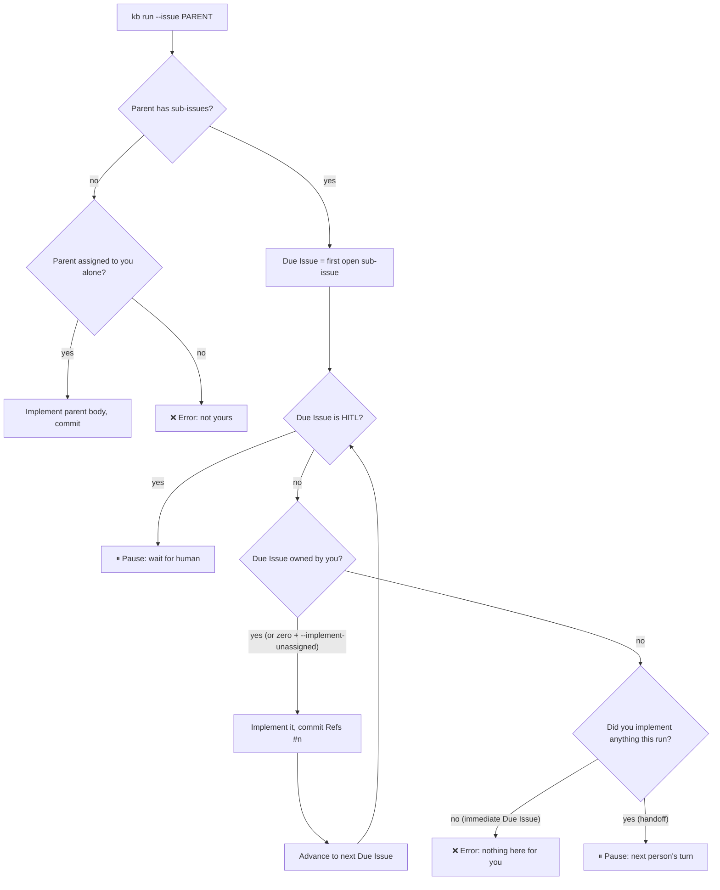
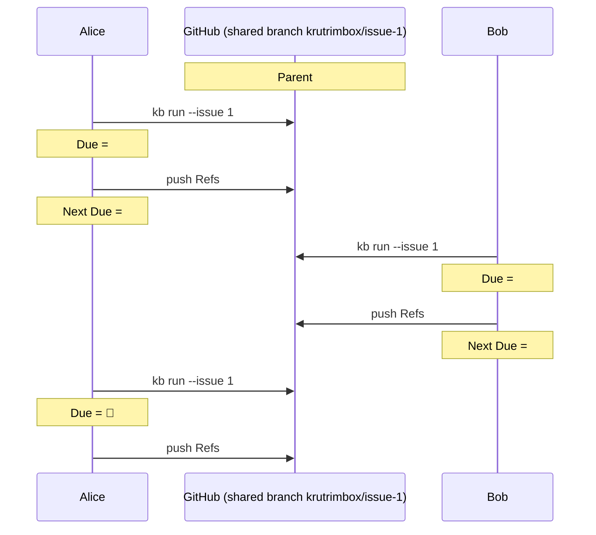

# Issue Ownership & Routing

This document explains how krutrimbox decides **which issues it works on** and **who is allowed to make it work on them**. It covers labeling, the GitHub permission model behind it, issue assignment, the per-issue ownership rule, the `--implement-unassigned` flag, and how one engine serves solo developers, small teams, and large teams that split a single epic across people.

It is the single source of truth for the assignee/ownership model. For the end-to-end Factory Run mechanics (sandboxes, commits, pull requests, lifecycle hooks) see [Factory Flow](./factory-flow). For the vocabulary, see [CONTEXT.md](https://github.com/jd-solanki/krutrimbox/blob/main/CONTEXT.md). The decisions recorded here are captured in ADR-0017, ADR-0018, and ADR-0019.

---

## 1. The one-line mental model

> krutrimbox implements an issue **only when that issue is assigned to you alone** — where "you" is the GitHub account krutrimbox is authenticated as (the **Operator**).

Everything below is a consequence of that single rule.

The Operator is whoever runs krutrimbox: krutrimbox matches issues against the authenticated `gh` user (GitHub's `assignee:@me`). Alice running it gets Alice's issues; Bob running it gets Bob's. It is the authenticated user, so there is nothing to configure.

---

## 2. Labels, and why they are a trust boundary

krutrimbox uses three labels:

| Label | Meaning |
|---|---|
| `ready-for-agent` | The issue is fully specified and ready for an agent to implement without a human. On a Target Issue it also makes the issue **discoverable**; on a sub-issue it marks an **AFK Issue**. |
| `ready-for-human` | The issue needs a human (a **HITL Issue**). krutrimbox pauses when it reaches one. |
| `krutrimbox` | Applied by krutrimbox to the pull requests it opens. |

**Applying a label on GitHub requires the Triage role or above.** A person with only Read access — or an outside contributor on a public repo — **cannot** add a label, *even to their own issue*. So `ready-for-agent` is never something a random reporter can self-apply; a trusted maintainer (Triage, Write, Maintain, or Admin) puts it there.

Because labelling is Triage-gated, the `ready-for-agent` label is krutrimbox's trust signal: its presence means a trusted maintainer judged the issue ready for an agent. krutrimbox keys discovery on the label together with the issue's assignee (Section 3) — both Triage-gated, team-visible facts that an arbitrary issue reporter cannot set. See **ADR-0017**.

> Reference: [GitHub repository roles](https://docs.github.com/en/organizations/managing-user-access-to-your-organizations-repositories/managing-repository-roles/repository-roles-for-an-organization) — "Apply/dismiss labels" starts at Triage.

---

## 3. Assignment, and why it is the routing signal

Assigning a user to an issue **also requires the Triage role or above** — the same trust tier as labeling. And a user can only *be* an assignee if they have at least Read access (organization member), have commented on the issue, or have Write permission. You cannot route an issue to a complete stranger.

So assignment is a **permission-gated, team-visible** fact recorded on GitHub. That makes it the right place to express *who should implement an issue* — far better than an invisible local CLI flag. If ownership needs to change, you reassign on GitHub, where the whole team sees it.

> Reference: [Assigning issues and pull requests](https://docs.github.com/en/issues/tracking-your-work-with-issues/using-issues/assigning-issues-and-pull-requests-to-other-github-users) — assignees limited to yourself, commenters, Write holders, and org members with Read; up to 10 assignees.

---

## 4. The Operator and ownership

An issue is **Owned** by the Operator when it is assigned to **exactly the Operator and nobody else**. The four assignee states:

| Assignee state | Is it yours? |
|---|---|
| **Exactly you** | ✅ Yours. |
| **One other person** | ❌ Theirs — explicitly claimed by someone else. |
| **Multiple people** (with or without you) | ❌ Ambiguous — krutrimbox cannot decide who implements it. |
| **Nobody** (zero assignees) | ❌ Unowned — *unless* you pass `--implement-unassigned` (then ✅). |

### The `--implement-unassigned` flag

> ⚠️ **Solo-developer escape hatch.** This flag makes krutrimbox treat a **zero-assignee** issue as yours. It exists **only for solo developers** who label issues but don't want the chore of assigning every issue (and every sub-issue) to themselves.
>
> It deliberately **disables the collision guard**: an unowned issue has no owner, so two people both running `--implement-unassigned` could grab the same issue. **In a team, don't use it — assign the issue instead.**

The flag only ever flips the **zero-assignee** case. It never lets you take an issue assigned to one other person, and never lets you take an ambiguous (multiple-assignee) issue.

---

## 5. Single-issue decision table

For a standalone issue (no sub-issues), or for any individual issue krutrimbox is deciding whether to act on:

| Assignees | Batch `kb run` (default) | Explicit `kb run --issue N` (default) | With `--implement-unassigned` |
|---|---|---|---|
| **Exactly you** | ✅ runs | ✅ runs | — (already runs) |
| **One other person** | not discovered (`assignee:@me` excludes it) | ❌ error: *"#N is assigned to @other, not you."* | ❌ still refused |
| **Zero** | not discovered | ❌ error: *"#N is not assigned to you — pass `--implement-unassigned`."* | ✅ **runs** (the only cell the flag changes) |
| **Multiple** | if you're one of them: surfaced by `assignee:@me`, then ⚠️ skip + warn, batch continues; otherwise not discovered → never runs | ❌ error: *"#N has multiple assignees; can't decide who implements."* | ❌ still refused |

With `--implement-unassigned` in batch, discovery can't use `assignee:@me` (it excludes unowned issues), so it switches to **label-only** discovery and then keeps only *exactly-you* and *zero* issues, skipping foreign and multiple.

---

## 6. Discovery: batch vs explicit

- **Batch — `kb run`** discovers **top-level** issues (no parent) that carry `ready-for-agent` and are assigned to you (`assignee:@me`), then processes each.
- **Explicit — `kb run --issue <parent-id>`** targets one issue **by its parent id**. krutrimbox **never takes a sub-issue id.** Even when your real work is a sub-issue, you pass the parent id and krutrimbox finds your slice inside it.

You reach for explicit mode in the large-team case: when the parent epic belongs to a teammate, batch won't discover it (it's not assigned to you), so you name the parent explicitly.

---

## 7. Sub-issues: the Due Issue, the Done Set, and the walk

A **Parent Target Issue** has ordered sub-issues (the **Implementation Sequence**, sorted by issue number). These are [GitHub's native sub-issues](https://docs.github.com/en/issues/tracking-your-work-with-issues/using-issues/adding-sub-issues) — the built-in parent/child relationship, not task-list checkboxes — so krutrimbox reads the hierarchy straight from GitHub. krutrimbox works through them strictly in order.

- **Done Set** — the set of sub-issue numbers that already have a `Refs #<n>` commit footer on the shared **Target Issue Branch** (`krutrimbox/issue-<parent>`). It is never stored; krutrimbox rebuilds it from the branch's git log every run. The branch history *is* the record of "what's already done." (ADR-0015)
- **Due Issue** — the first sub-issue that is still **open** (lowest number not in the Done Set). It is the only sub-issue eligible to be worked on right now.

### The walk loop

Each round, krutrimbox looks at the current Due Issue and decides:

1. **Due Issue is HITL** → **pause** (wait for a human; existing behavior).
2. **Due Issue is yours** (assigned to exactly you, or zero with `--implement-unassigned`) → **implement** it, commit a `Refs #<n>` footer (which adds it to the Done Set), then look at the *next* Due Issue and repeat.
3. **Due Issue is not yours** → **error** *or* **pause**:
   - **Error** if this is the **immediate** Due Issue and krutrimbox has done **nothing** this run — you ran a parent that has nothing for you to do right now.
   - **Pause** if krutrimbox has **already implemented one or more** of your sub-issues this run — your part is done; hand off to the next owner.
4. **Parent has no sub-issues** and is not yours → **error**.

The error-vs-pause split is the key nuance: *error = "nothing here for you"; pause = "your part is done, handing off."*

---

## 8. The three personas

The same engine degrades gracefully. A solo dev never touches sharing; a small team never touches sub-issue routing; only large teams light up the shared-branch path.

| | **Solo dev** | **Small team** | **Large team** |
|---|---|---|---|
| **Work shape** | One person, whole sequences | Each member owns whole Target Issues | Shared epics, sub-issues split across members |
| **Assignment** | Often none → `--implement-unassigned` | Each top-level issue assigned to one owner | Parent may be a lead's; each sub-issue assigned to its implementer |
| **Discovery** | `kb run` (+flag) | `kb run` → `assignee:@me` | `kb run` for epics you own; **`kb run --issue <parent>`** for your slice under someone else's parent |
| **Branch** | yours alone | one owner per epic, no sharing | **shared** parent branch, serialized by the Done Set |

### Worked examples (large team)

Parent `#1` belongs to a teammate. You run `kb run --issue 1` each time.

1. **First sub-issue is yours.** Sub-issues: `#2` (you), `#3` (Bob). Due = `#2` → krutrimbox logs that the parent isn't yours but the Due Issue `#2` is, implements `#2`, then reaches `#3` (Bob's) → **pause** (handoff).
2. **Your slice is later.** `#2`,`#3` are Bob's and already pushed (in the Done Set); `#4` is yours. Due = `#4` → implement `#4`.
3. **Blocked on a teammate.** `#2`,`#3` are Bob's and **not yet done**. Due = `#2` (Bob's, immediate, nothing done this run) → **error**. You wait for Bob to finish `#2`/`#3`, then your run picks up at `#4`.

---

## 9. Edge cases & FAQ

- **You own the parent, but the first sub-issue is a teammate's and not done.** Due Issue is theirs and immediate → **error**. Ownership of the parent does not let you skip ahead; order is enforced by the Due Issue.
- **Why not let me run a sub-issue id directly?** Branch, pull request, sandbox, and Done Set all key on the parent. Targeting the parent keeps one mental model and one shared branch per epic.
- **Why can't I take an issue assigned to one other person, even with the flag?** That assignment is an explicit, team-visible claim. To take it over, reassign it on GitHub — then it's yours by the normal rule. The flag only covers *unowned* (zero-assignee) issues.
- **How do I split one epic across people without sub-issue routing?** Either assign each sub-issue to its implementer (large-team mode above), or split the work into separate top-level Target Issues, each owned by one person (the clean small-team model).
- **Two operators, same unassigned issue.** Only possible with `--implement-unassigned`. The single-assignee rule is what normally guarantees one operator per issue; the flag opts you out of that guarantee, which is why it's a solo-only tool.
