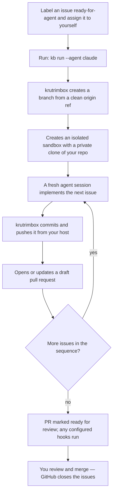

# Quickstart

krutrimbox is a local orchestrator for agent-ready GitHub issues. You label an issue `ready-for-agent`, run `kb run --agent <agent>`, and it spins up an isolated **local** [Docker Sandbox](https://docs.docker.com/ai/sandboxes/), delegates the work to a coding agent (Codex or Claude Code), and opens a pull request — while every GitHub write stays on your machine, under your own credentials.

It works on **any project, in any language**. The `kb` CLI happens to be built with Node, but the code it implements is whatever your repository is written in — TypeScript, Python, Go, Rust, anything.

## How it works

From your point of view, one command turns a labeled issue into a reviewed pull request. krutrimbox keeps every GitHub write on your host while the agent works in an isolated sandbox.



The rest of this page gets you to that first run. For *why* it works this way — the isolation and the read-only security boundary — see [Why krutrimbox](./why).

## Prerequisites

You run krutrimbox from your host machine. Install these once:

- **Git**
- **GitHub CLI** (`gh`), authenticated against the repo you'll work in
- **Node.js** (LTS or newer) — only to install and run the `kb` CLI itself, not your project
- **Docker** Desktop or a working Docker Engine
- **Docker Sandboxes CLI** (`sbx`) — see below
- **A coding agent** authenticated for sandboxes — Codex and/or Claude Code (see [Authentication](./authentication))

### Install the Docker Sandboxes CLI

::: code-group

```sh [macOS]
brew install docker/tap/sbx
sbx login
```

```powershell [Windows]
winget install -h Docker.sbx
sbx login
```

```sh [Linux (Ubuntu)]
curl -fsSL https://get.docker.com | sudo REPO_ONLY=1 sh
sudo apt-get install docker-sbx
sudo usermod -aG kvm $USER
newgrp kvm
sbx login
```

:::

`sbx login` opens a browser sign-in and, on first run, prompts for a default network policy (Prefer `open` or `balanced`).

## Install krutrimbox

```sh
npm install --global krutrimbox
kb --help
```

## Your first run

First complete [Authentication](./authentication) — it's the only required setup.

Now create a tiny, **tooling-free** issue so you can watch krutrimbox work end to end. This task only writes a small text file, so it runs on **any** project — Python, Go, Rust, anything — with no custom sandbox template needed:

```sh
# Verify the ready-for-agent label exists; create it if it doesn't
# (krutrimbox also creates it automatically on first run)
gh label list | grep -q '^ready-for-agent' \
  || gh label create ready-for-agent --description "Ready for an agent to implement"

# Create the demo issue — assigned to you and labeled ready-for-agent
gh issue create \
  --title "docs: add a HELLO.md greeting" \
  --body "Create a file named HELLO.md in the repository root with a short, friendly one-line greeting." \
  --label ready-for-agent \
  --assignee @me
```

`gh issue create` prints the new issue's URL — take its number and run krutrimbox against it:

```sh
kb run --issue <number> --agent claude
```

What happens next: krutrimbox creates a branch from a clean `origin` ref, creates an isolated sandbox with a private clone of your repo, runs a fresh agent session to implement the issue, commits the result, pushes it **from your host**, and opens a draft pull request titled after your issue. When all the work is done it marks the PR ready for review and runs any hooks you've configured.

Once you've seen it work, process every eligible issue assigned to you in one batch run:

```sh
kb run --agent claude
```

::: tip Bigger tasks? Use sub-issues
For multi-step work, break a Target Issue into [GitHub's native sub-issues](https://docs.github.com/en/issues/tracking-your-work-with-issues/using-issues/adding-sub-issues) — the built-in parent/child relationship, not task-list checkboxes. krutrimbox walks them in issue-number order, one commit each, on a single branch and pull request. Run the parent with `kb run --issue <parent> --agent claude`. See [Issue Ownership & Routing](./concepts/issue-ownership-and-routing).
:::

::: tip Most projects need a sandbox template
The default sandbox image ships the agent CLI and Node — but not your project's toolchain (pnpm, uv, the Go toolchain, …). If your build or tests need tools the default image lacks, build a small custom template once. See [Sandbox Template](./sandbox-template).
:::

## Next steps

- [Why krutrimbox](./why) — the problem it solves and the safety model behind it.
- [Getting Started](./getting-started) — the full one-time setup, step by step.
- [Running krutrimbox](./running) — base branches, issue ownership, batch vs. explicit runs.
