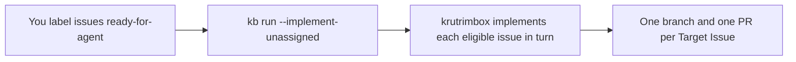
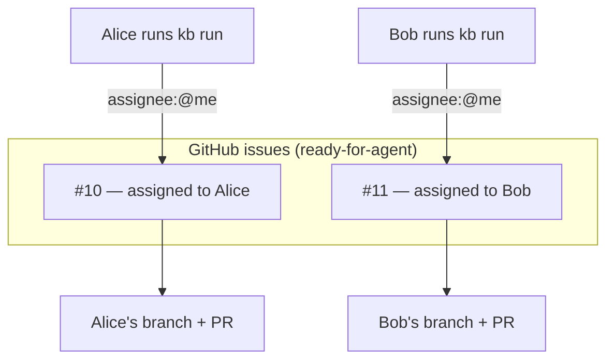
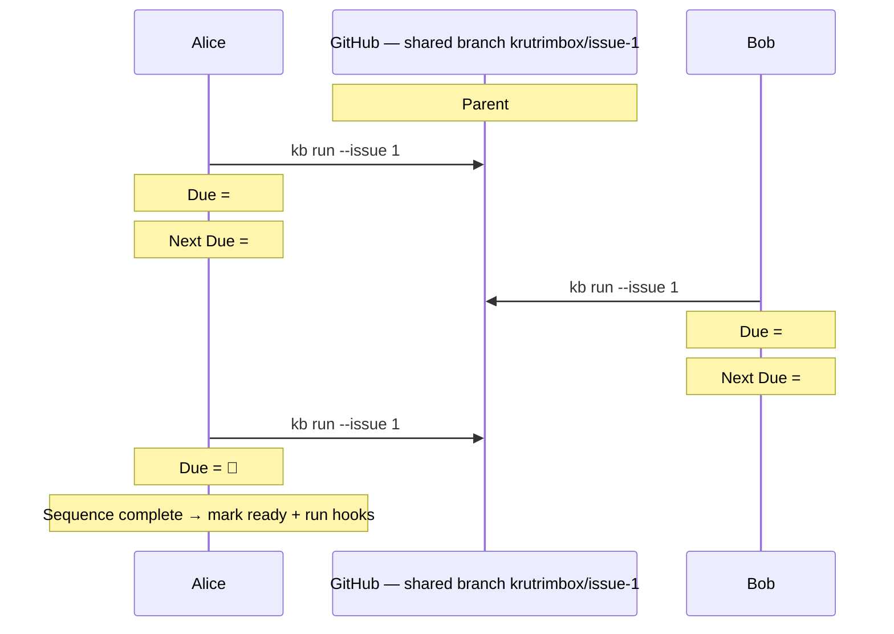

# Team Workflows

The same engine serves a solo developer, a small team, and a large team splitting one epic across people. What changes is **how you assign issues** — krutrimbox implements an issue only when it is assigned to **you alone** (or has no assignee and you pass `--implement-unassigned`).

This page shows the three common shapes. For the full ownership rules, decision tables, and edge cases, see [Issue Ownership & Routing](./concepts/issue-ownership-and-routing).

## Solo developer

You own everything. Label issues `ready-for-agent` and run batch mode. Assigning issues to yourself is optional — pass `--implement-unassigned` to let krutrimbox pick up issues with no assignee.

```sh
kb run --implement-unassigned --agent claude
```



::: warning
`--implement-unassigned` disables the collision guard (an unassigned issue has no owner). It's a solo-only convenience — on a team, assign the issue instead.
:::

## Small team

Each member owns whole issues. Assign every top-level issue to exactly one person. Each member just runs `kb run` — discovery uses `assignee:@me`, so everyone only picks up their own work. No branch is shared.

```sh
# Each member runs this; each gets only their assigned issues
kb run --agent claude
```



## Large team

One epic is split across people: a parent issue (often owned by a lead) with sub-issues, each assigned to its implementer. Everyone runs the **parent** explicitly. krutrimbox walks the sub-issues in number order on one shared branch, implements the ones assigned to you, and pauses to hand off when the next due sub-issue belongs to someone else.

```sh
# Run the parent epic explicitly; krutrimbox finds your slice inside it
kb run --issue 1 --agent claude
```

The shared branch is serialized by the **Done Set** (rebuilt from `Refs #<n>` commit footers), so each person's run resumes exactly where the last left off:



A run **errors** instead of pausing when the immediate due sub-issue isn't yours and you've done nothing this run ("nothing here for you yet"); it **pauses** once you've implemented at least one sub-issue this run ("your part is done, handing off"). See [Issue Ownership & Routing](./concepts/issue-ownership-and-routing#7-sub-issues-the-due-issue-the-done-set-and-the-walk) for the full walk.
